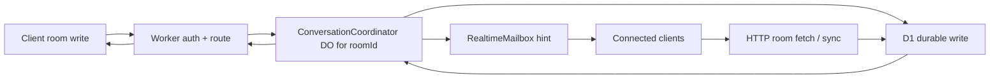

# Conversation Durable Object Implementation Plan

Status: PR 2 implemented in this branch - room and membership mutation serialization

## Summary

Voyager will add Conversation Durable Objects across three focused PRs. The goal is room-write correctness, not primary speed optimization. A per-room Durable Object coordinates mutation order while D1 remains the durable source of truth, existing HTTP response shapes stay stable, and realtime remains a lightweight hint layer.

MLS and hosted agent runtime sequencing are future beneficiaries only. They are not planned or implemented in these three PRs.

## Architecture Boundary

- D1 remains authoritative storage for rooms, memberships, messages, delivery receipts, invitations, attachments, and sync recovery.
- `ConversationCoordinator` Durable Objects serialize writes for one room at a time using `idFromName(roomId)`.
- The existing `RealtimeMailbox` Durable Object remains the foreground WebSocket fanout layer.
- Realtime events are still hints. Clients recover authoritative state through HTTP room fetches and `/v1/sync`.
- Public `/v1` request and response shapes should stay compatible throughout the first three PRs.

## PR 1: Conversation DO Design And Message Sequencing

This PR introduced the per-room coordinator and routes only message sends through it.

### Implementation Scope

- Add a `ConversationCoordinator` Durable Object bound as `CONVERSATION_COORDINATOR`.
- Add a Wrangler Durable Object migration tag such as `v2-conversation-coordinator`.
- Route only `POST /v1/rooms/{roomId}/messages` through the room coordinator using `idFromName(roomId)`.
- Keep the existing message-send core as the D1-backed source of truth for:
  - membership and policy validation;
  - idempotency by `(senderDeviceId, idempotencyKey)`;
  - `serverSequence` allocation;
  - message insert;
  - delivery receipt creation;
  - attachment reference marking;
  - room version/update bump;
  - realtime `room.message` hint after durable D1 write.
- Keep the public API unchanged:
  - same request body;
  - same response shape;
  - same status codes and error shape;
  - same client behavior.
- Extend `Server-Timing` for message sends with a `conversationDo` timing metric.

### Intentional Non-Goals

- No membership mutation serialization in PR 1.
- No room creation changes.
- No client contract changes.
- No Conversation DO read model.
- No MLS epoch or agent runtime sequencing.

### PR 1 Tests

- `npm run check`
- `npm run smoke:backend:local`
- `npx wrangler deploy --dry-run`
- Send multiple concurrent messages to one room and assert unique, contiguous per-room `serverSequence` values.
- Retry the same idempotency key and assert the same message response.
- Verify realtime `room.message` still matches `envelopeId`, `serverSequence`, and `senderDeviceId`.
- Verify current web, desktop, and mobile clients need no API changes.

## PR 2: Room And Membership Mutation Serialization

This PR routes membership-sensitive room mutations through the same per-room coordinator.

### Implementation Scope

- Route these room mutations through `ConversationCoordinator`:
  - archive room;
  - update room metadata;
  - add agent member;
  - remove member;
  - leave room;
  - role change;
  - ownership transfer propose/accept;
  - room invitation create/accept/decline where room membership or invitation state is mutated.
- For routes that do not include `roomId` directly, resolve the room id first in the Worker, then forward the mutation to the room coordinator.
- Keep existing authorization rules and response shapes unchanged.
- Keep room creation outside the coordinator for now because new rooms do not yet have an existing per-room concurrency surface.

### Timeline Boundary

- PR 1 orders message writes.
- PR 2 orders membership and room mutations relative to later writes.
- MLS epoch behavior is still not included.

### PR 2 Tests

- Member removal versus later send rejection.
- Metadata update, invitation decline/accept, role change, ownership transfer, and member removal.
- Ownership transfer accept serialization.
- Room invitation acceptance creates membership exactly once.
- Existing authorization and response-shape smoke coverage remains green.

## PR 3: Recovery, Reconciliation, Observability, And Smoke Hardening

This PR will harden operational behavior after write coordination is in place.

### Planned Scope

- Add recovery and retry coverage:
  - duplicate idempotency retry after DO restart still returns the existing message;
  - concurrent sends produce unique, contiguous per-room `serverSequence`;
  - failed realtime hint does not roll back a durable D1 message write;
  - D1 reads remain sufficient for client recovery after any DO failure.
- Add observability:
  - structured logs for Conversation DO message and mutation timing;
  - minimal development-safe identifiers;
  - `Server-Timing` coverage for routed write paths.
- Extend local and remote smoke:
  - concurrent message sends to the same room;
  - duplicate idempotency retry;
  - membership mutation followed by message-send ordering;
  - remote smoke remains focused and non-polluting.
- Add operational guidance:
  - deploys require Wrangler Durable Object binding and migration before Worker code uses the class;
  - remote post-deploy smoke is the first deployed guard;
  - Conversation DO is write coordination, not the client read source.

### PR 3 Tests

- `npm run check`
- `npm run smoke:backend:local`
- `npm run smoke:backend:remote` after deploy
- `npx wrangler deploy --dry-run`
- Targeted retry/recovery cases.
- Log and timing checks for routed write paths.

## Later: MLS And Hosted Agent Runtime Sequencing

MLS and hosted agent runtimes are intentionally outside this three-PR plan. Conversation DO write coordination should make those later systems easier to introduce because a room will already have a single mutation-ordering boundary, but this plan does not design MLS epochs, MLS commits/proposals, live agent execution, billing, push wakeups, or hosted runtime scheduling.
